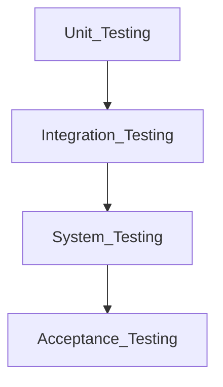
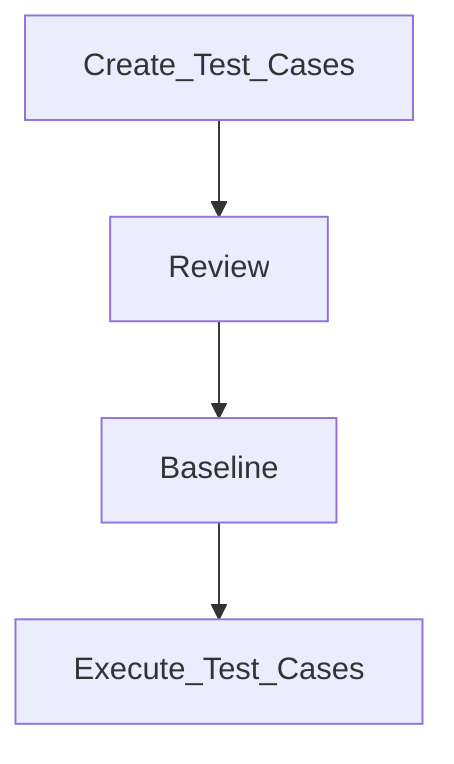

## Why is unit testing important for developers?
> Through unit testing, software developers know source code works at the atomic level.

## What is unit testing in computer programming?
> Unit testing is a powerful tool for software quality...and has been for decades. Unit tests provide a fundamental check that an application meets its software design specifications and behaves as intended.

When done well, unit tests:
  * decrease defects and expose them early in the development lifecycle;
  * increase code readability;
  * enable code reuse; and
  * improve deployment velocity.

Unit tests, a type of functional test, have reached majority adoption; they are simply how many development teams do business.

Unit testing is one of the levels of software testing that helps to test individual units of source code to determine whether they are usable.
A unit is the smallest software component that usually performs a single cohesive function: it is small, so defects identified during unit 
testing are easy to discover and fix.

## The objective of Unit Testing is:

   * To isolate a section of code.
   * To verify the correctness of the code.
   * To test every function and procedure.
   * To fix bugs early in the development cycle and to save costs.
   * To help the developers to understand the code base and enable them to make changes quickly.
   * To help with code reuse.

## Types of Unit Testing
There are 2 types of Unit Testing: Manual, and Automated.

## Workflow of Unit Testing: 

## Unit Testing Techniques:
 There are 3 types of Unit Testing Techniques. They are

   * **Black Box Testing:** This testing technique is used in covering the unit tests for input,
   user interface, and output parts.
   * **White Box Testing:** This technique is used in testing the functional behavior of the 
   system by giving the input and checking the functionality output including the 
   internal design structure and code of the modules.
   * **Gray Box Testing:** This technique is used in executing the relevant test cases, 
   test methods, test functions, and analyzing the code performance for the modules.
   
## Advantages of Unit Testing:
  * Unit Testing allows developers to learn what functionality is provided by a unit and 
  how to use it to gain a basic understanding of the unit API.
  * Unit testing allows the programmer to refine code and make sure the module works properly.
  * Unit testing enables testing parts of the project without waiting for others to be completed.
